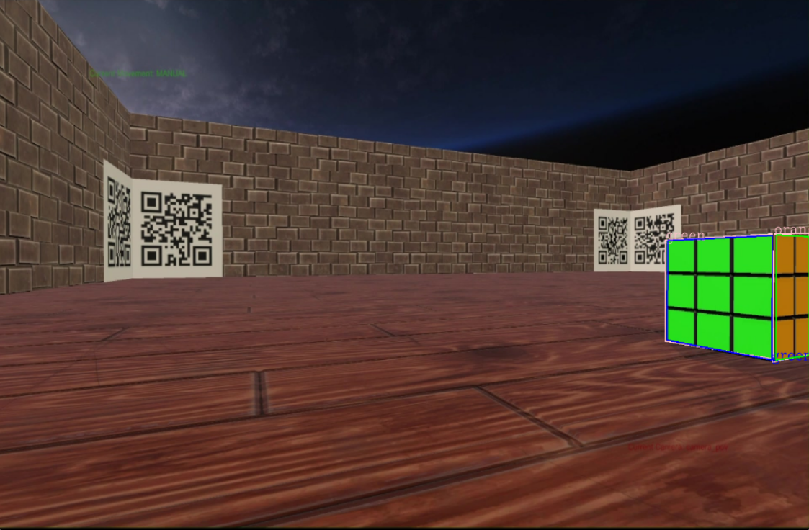
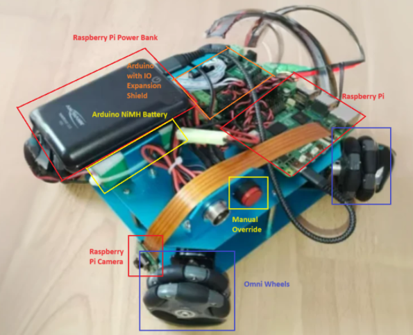
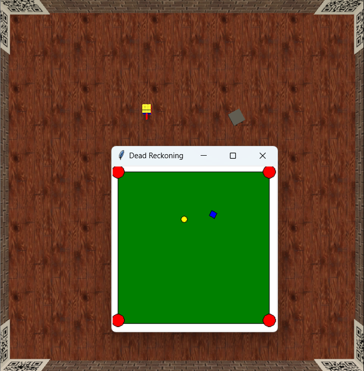
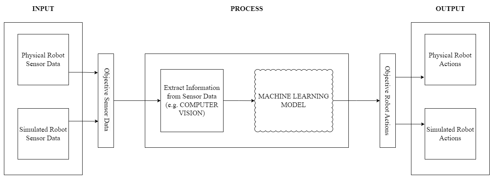
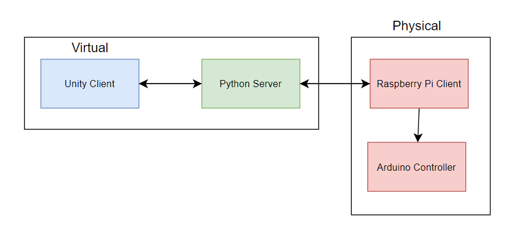

<!-- Improved compatibility of back to top link: See: https://github.com/othneildrew/Best-README-Template/pull/73 -->

<!--
*** Thanks for checking out the Best-README-Template. If you have a suggestion
*** that would make this better, please fork the repo and create a pull request
*** or simply open an issue with the tag "enhancement".
*** Don't forget to give the project a star!
*** Thanks again! Now go create something AMAZING! :D
-->

<!-- PROJECT SHIELDS -->
<!--
*** I'm using markdown "reference style" links for readability.
*** Reference links are enclosed in brackets [ ] instead of parentheses ( ).
*** See the bottom of this document for the declaration of the reference variables
*** for contributors-url, forks-url, etc. This is an optional, concise syntax you may use.
*** https://www.markdownguide.org/basic-syntax/#reference-style-links
-->

<h3 align="center">Autonomous Combat Robot</h3>

  

    NEXUS 4WD / Unity simulation for an autonomous combat robot. Uses a camera to learn about its environment, beacon-based localisation with QR codes to localise.

<!-- ABOUT THE PROJECT -->
## About The Project

This project explores the effectiveness of extracting meaningful information about the environment from sensors, specifically a camera, and using this information to make decisions which directly act upon the environment. A simulation was developed alongside the physical system to mimic the actions of the physical system without encountering physical limitations such as lack of space or friction with the ground. This form of digital twinning was especially advantageous for testing purposes.

  

(<a href="#readme-top">back to top</a>)

<!-- USAGE EXAMPLES -->
## Usage

### Physical Robot

The robot being used in the project is Nexus Robot’s 4WD 58mm Omni Wheel Arduino Robot. The robot is powered by a custom Arduino with an ATmega328 microcontroller, similar to the Arduino Duemilanove. The arduino is used to command the motors used to drive the wheels. It contains four Omnidirectional Wheels, allowing the robot extensive range of movement in most directions. It is equipped with a Raspberry Pi 5 which communicates directly with the server. This was decided due to the Arduino’s low processing power, which should be focused directly on controlling the wheels. It wears a Raspberry Pi Camera Module 3, a high quality camera designed specifically for the Raspberry Pi. It has an onboard powerbank used to charge the Raspberry Pi, allowing for a greater range of movements and no reliance on plug sockets. The Arduino is charged using an onboard NiMH battery. The Raspberry Pi and Arduino are connected via a serial USB connection to allow for fast transmission of information between the components.

  

- The **Raspberry Pi** is running a client script which connects to the server, transmits image and robot information in a JSON format (e.g. raw image data and control information about the robot, whether the robot is currently in autonomous or manual mode). This script also handles server response, parsing the JSON reply and handling the corresponding data by communicating with the Arduino.
-  The **Arduino** runs a script which receives movement commands from the Raspberry Pi, which are JSON encoded with two parameters, velocity and angular_velocity, and translates these into motor controller commands. An interface was created to abstract the process of controlling the wheels.

### Simulation

  

A simulation was created alongside in Unity. Creating a simulation alongside the physical solution is a form of digital twinning. By using a digital twin, simulated tests can be run to predict how the robot might react to various scenarios without the risks and costs associated with real-world testing. This not only enhances safety but also improves the development cycle by allowing for rapid iterations.

- **Possibility for Multiple Opponents**: Due to hardware limitations, only one physical robot can be used. However, there are unlimited capabilities in the simulation. For example, the same decision making script can be ran on multiple opponents to benchmark its capabilities.
- **Contained Environment**: The simulated environment is not susceptible to external factors, such as friction, wind, etc. This allows for isolated testing of robot movement without the imperfections imposed by the physical world.
- **Modular Arena Size**: The simulated arena can easily be made larger or smaller, whereas there are physical space limitations.

### Visualiser

A program was created in Tkinter to visualise the server's estimate of the robot's current position using either dead reckoning or QR-code based beacon localisation. **Dead Reckoning** is the process of calculating an object’s current position based on known information of its current state. It is a commonly used technique to localise in an environment, given information about the starting position of a robot and information about its surroundings.

  

**Beacon-based localization** allows for highly accurate localization and mapping without using any distance-based sensors; only a single camera is required. This allows effective localization of the robot and mapping of its surroundings without the need for a distance sensor.

  

(<a href="#readme-top">back to top</a>)

## Architecture

This project can be split into three distinct layers: input, processing, and output.
- First, sensor data must be collected from the robot. In the simulation, a camera will be
situated on the robot player, mimicking the physically mounted Raspberry Pi camera on the
robot.
- Then, the collected data must be processed to retrieve meaningful information from the
images. This process will be the same regardless of how the input data was collected. Then,
decisions must be made based on how to move the robot.
- Finally, this information will be sent back to the client which will then move according to
the instructions.

  

In the simulation, the sensor data will be collected from Unity and sent locally to a Python server
that is running on the same machine. Whereas, on the physical robot, the camera data will be
collected from the Raspberry Pi and sent to the Python server remotely. The server will reply in
both cases with instructions for the robot to move, however in the physical system the Raspberry
Pi will handle and deliver these instructions to the Arduino which controls the physical motors.

  

<!-- ROADMAP -->

<!-- LICENSE -->
## License

Distributed under the MIT License. See `LICENSE.txt` for more information.

(<a href="#readme-top">back to top</a>)

<!-- MARKDOWN LINKS & IMAGES -->
<!-- https://www.markdownguide.org/basic-syntax/#reference-style-links -->
[contributors-shield]: https://img.shields.io/github/contributors/github_username/repo_name.svg?style=for-the-badge
[contributors-url]: https://github.com/github_username/repo_name/graphs/contributors
[forks-shield]: https://img.shields.io/github/forks/github_username/repo_name.svg?style=for-the-badge
[forks-url]: https://github.com/github_username/repo_name/network/members
[stars-shield]: https://img.shields.io/github/stars/github_username/repo_name.svg?style=for-the-badge
[stars-url]: https://github.com/github_username/repo_name/stargazers
[issues-shield]: https://img.shields.io/github/issues/github_username/repo_name.svg?style=for-the-badge
[issues-url]: https://github.com/github_username/repo_name/issues
[license-shield]: https://img.shields.io/github/license/github_username/repo_name.svg?style=for-the-badge
[license-url]: https://github.com/github_username/repo_name/blob/master/LICENSE.txt
[linkedin-shield]: https://img.shields.io/badge/-LinkedIn-black.svg?style=for-the-badge&logo=linkedin&colorB=555
[linkedin-url]: https://linkedin.com/in/linkedin_username
[product-screenshot]: images/screenshot.png
[Next.js]: https://img.shields.io/badge/next.js-000000?style=for-the-badge&logo=nextdotjs&logoColor=white
[Next-url]: https://nextjs.org/
[React.js]: https://img.shields.io/badge/React-20232A?style=for-the-badge&logo=react&logoColor=61DAFB
[React-url]: https://reactjs.org/
[Vue.js]: https://img.shields.io/badge/Vue.js-35495E?style=for-the-badge&logo=vuedotjs&logoColor=4FC08D
[Vue-url]: https://vuejs.org/
[Angular.io]: https://img.shields.io/badge/Angular-DD0031?style=for-the-badge&logo=angular&logoColor=white
[Angular-url]: https://angular.io/
[Svelte.dev]: https://img.shields.io/badge/Svelte-4A4A55?style=for-the-badge&logo=svelte&logoColor=FF3E00
[Svelte-url]: https://svelte.dev/
[Laravel.com]: https://img.shields.io/badge/Laravel-FF2D20?style=for-the-badge&logo=laravel&logoColor=white
[Laravel-url]: https://laravel.com
[Bootstrap.com]: https://img.shields.io/badge/Bootstrap-563D7C?style=for-the-badge&logo=bootstrap&logoColor=white
[Bootstrap-url]: https://getbootstrap.com
[JQuery.com]: https://img.shields.io/badge/jQuery-0769AD?style=for-the-badge&logo=jquery&logoColor=white
[JQuery-url]: https://jquery.com 
